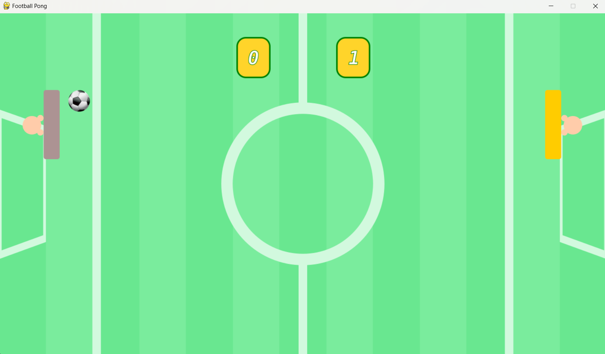
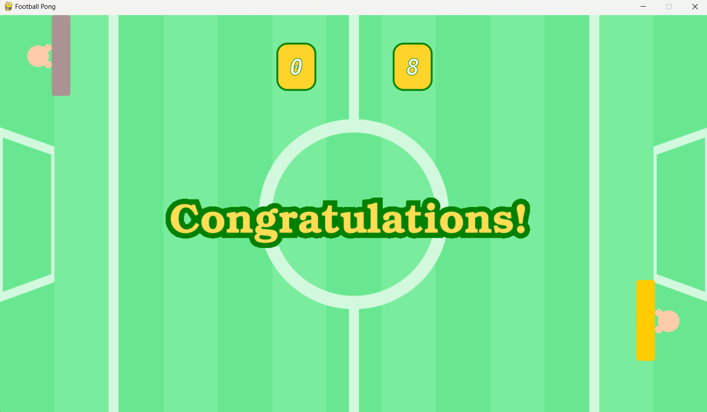

Foi feito no PyCharm e apenas como uma introdução ao desenvolvimento de jogos com base em um curso online. Não está realmente "jogável", mas ainda vou adaptar pra essa possibilidade quando eu tiver foco em desenvolvimento de jogos.

